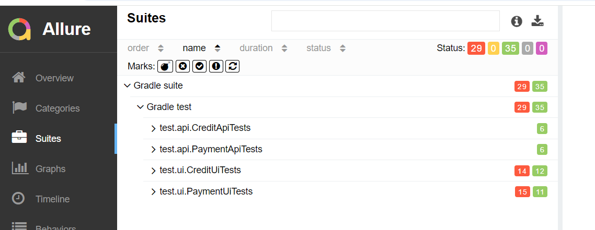
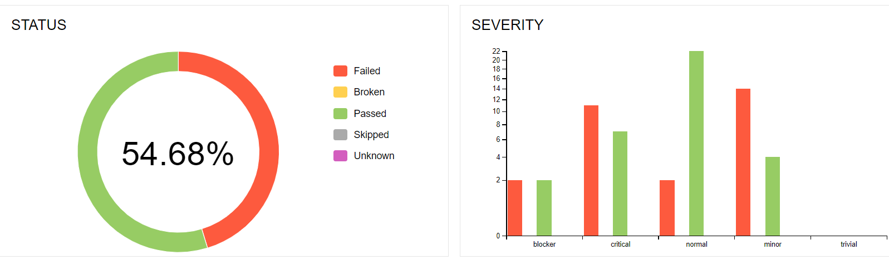
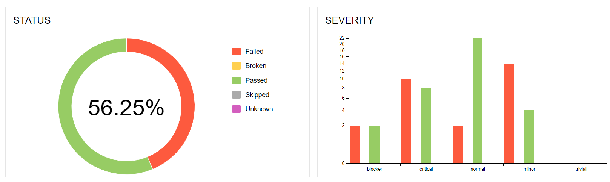

### Отчёт по итогам тестирования.

* Отчёт по результату автоматизированного тестированию функционала покупки и оформления кредита по данным карты веб-сервиса покупки тура
"Путешествие дня". 

## Количество тест-кейсов.

* Всего было проведено 64 автотестов. Общий процент успешных тестов равен 56,25%. 

## Результаты тестов по градации серьезности:

## Результаты тестов по тестируемому функционалу:

## Заключение.
Результаты проверки показывают, что 56,25 % тестов были пройдены успешно.
28 тестов не были успешны, что говорит нам о необходимости проработки и исправления выявленных ошибок,чтобы повысить качество и стабильность веб-сервиса.